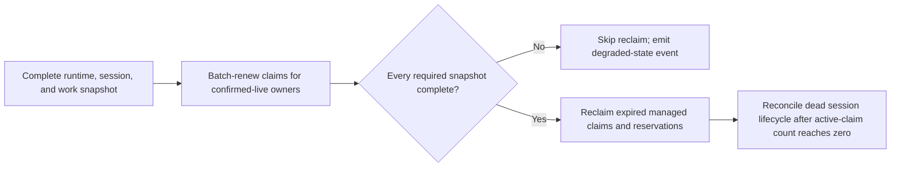

# Replacing failure-driven unclaim with Beads leases

> **Status:** Recommendation and migration proposal for review; not an approved implementation spec
> **Date:** 2026-07-09
> **Scope:** Work ownership recovery after a session or worker fails. This report
> intentionally excludes broad control-plane CAS, drain epochs, and unrelated retry
> semantics.

## Executive verdict

Gas City should make expiring leases the eventual source of truth for recovering
`in_progress` work from failed sessions. That would replace repeated
"list work, infer whether an assignee is dead, re-read it, then unassign it" logic
with one storage-level transition: an unrenewed claim expires and is atomically
returned to `open`.

Gas City should **not** switch to the current Beads lease implementation yet. The
mechanism is promising, but the available implementation misses several parts of
Gas City's ownership contract:

1. Gas City workflow work defaults to `no_history` under the bd 1.0.5 policy, and
   Beads stores `no_history` rows in `wisps`. Claims stamp lease columns on those
   rows, but the public heartbeat rejects them and reclaim scans only `issues`.
2. Gas City also preassigns `open` continuation siblings. Those are reservations,
   not `in_progress` claims, so claim leases cannot recover them.
3. Gas City uses reusable names and aliases as assignees, and even a canonical
   session bead may survive multiple runtime incarnations. Beads treats the
   assignee string as the lease owner, so a replacement can renew a prior
   incarnation's work. A per-claim or per-incarnation token is required.
4. A lease is not yet an attempt fence. The CLI checks actor against assignee, but
   a replacement that reuses the same actor string is indistinguishable from the
   expired process, and the storage close itself has no owner/token predicate.
5. The deployed Beads line has no lease stack and already uses migration number
   `0054` for different indexes.

The recommended target is:

- Gas City claims managed work with a canonical session identity, an opaque
  attempt token, and an expiring lease.
- The orchestrator renews leases for sessions it has confirmed live. Agents do not
  have to remember to heartbeat during a long model turn or command.
- On each ordered reconciliation phase, the orchestrator renews live claims first,
  then asks Beads to reclaim expired claims. Any partial liveness or store snapshot
  suppresses reclaim.
- Intentional close, retirement, and handoff use an immediate guarded revoke or
  transfer instead of waiting for expiry.
- Open continuation assignments either become leased reservations or stop being
  preassigned.

After those gates, the 378-line shell orphan sweep and its 11-line order are
directly deletable. Default death/boot unclaim generation and Gas City's hand-built
conditional-release plumbing are additional deletion candidates. The much larger
steady-state Go orphan engine becomes narrower rather than disappearing because it
still owns reservations, detached executors, legacy invariants, and session
lifecycle.

## Evidence baseline

The analysis used these local source baselines:

| Source | Revision | Relevance |
| --- | --- | --- |
| Gas City worktree | `738c11517` | Current claim, release, session, and orphan-recovery behavior |
| Deployed Beads checkout, `local/deploy-current-integrated` | `d3f82bd810` | What Gas City can deploy today; lease/unclaim/CAS commits are not ancestors |
| Beads immediately before the CAS feature commit | `fb527d034` | Merged lease and unclaim behavior without conflating it with CAS changes |
| Beads CAS worktree, `cas/pr` | `f9a929f03` | Unmerged whole-row and metadata CAS surface |

The lease stack landed in Beads commit `e97839a2e`; `bd unclaim` landed in
`31a6ec951`; the inspected CAS feature is `f9a929f03`. The deployed checkout was
read only for this research because it contains unrelated local changes.
Gas City also currently pins the pre-lease Beads library at `v1.1.0`
(`go.mod:24`) and its current-source CLI cell at `8c958d225c...`
(`deps.env:18-22`).

The inspected CAS line and Beads' choose-your-own-backend/SQL lease line are
separate feature histories. No inspected revision composes both, so provider
parity cannot be inferred from either branch in isolation.

## What Beads provides

### Atomic claim already exists and Gas City already uses it

`ClaimIssueInTx` performs a conditional update only while a row is `open` and
unassigned, or already assigned to the same actor. A same-actor retry of an
`in_progress` claim is idempotent. It routes claims to `issues` or `wisps`
(`internal/storage/issueops/claim.go:21-124` in the Beads checkout).

Gas City's `gc hook --claim` reaches that operation through `BdStore.Claim`, which
runs `bd update <id> --claim --json` and supplies the chosen assignee as
`BEADS_ACTOR` (`internal/beads/bdstore.go:1269-1294` and
`cmd/gc/cmd_hook_claim.go:395-417,571-595`). The acquisition side is therefore not
the complexity targeted by this proposal. Recovery and release are.

### The upstream lease lifecycle

The merged Beads lease stack adds `lease_expires_at`, `heartbeat_at`, and
`row_lock` to both `issues` and `wisps`. Its observable contract is:

| Operation | Current behavior |
| --- | --- |
| Claim | Stamps `lease_expires_at = now + TTL`, `heartbeat_at = now`, and a fresh `row_lock` |
| Same-owner claim retry | Returns success for an already `in_progress` row but does not renew its lease |
| TTL | Defaults to 5 minutes; `WithLeaseTTL` is a context-only override, not a CLI/config option |
| Heartbeat | Extends one owner-held `in_progress` lease; owner and status are checked atomically |
| Reclaim | Reopens leases older than a cutoff, clears assignee, `started_at`, and lease fields, and records `lease_reclaimed` |
| Reaper | None is automatic; a supervisor must schedule reclaim |
| CLI | `bd heartbeat <id>` and `bd reclaim --older-than <duration>` |
| Default recovery delay | 5-minute TTL plus a default 10-minute post-expiry grace, approximately 15 minutes after the last renewal |

The core behavior is in
`internal/storage/issueops/lease.go:14-211`; the commands are in
`cmd/bd/heartbeat.go:12-88` and `cmd/bd/reclaim.go:13-95`. Tests cover claim
stamping, owner-only renewal, expiry, grace, and concurrent heartbeat/reclaim/close
(`internal/storage/dolt/lease_test.go:61-225,310-440`).

`row_lock` is important but easy to overinterpret. It makes concurrent Dolt
transactions that heartbeat, reclaim, update, or close the same row conflict and
retry instead of silently cell-merging. It does **not** stop an old worker from
issuing an unguarded mutation after reclaim has completed.

The Go lease surface is also still internal to Beads. The root package aliases the
base `Storage` and common issue types, but not `BulkIssueStore`, the lease result,
or the conditional-write errors (`beads.go:19-20,103-125` and
`internal/storage/bulk_issues.go:10-25` in Beads). Gas City's native adapter holds
the root `beadslib.Storage` interface (`internal/beads/native_dolt_store.go:156-175`),
so it cannot name the current reclaim result type. The CLI path is inspectable, but
direct provider integration needs an exported, typed lease interface.

### `bd unclaim` is not the immediate-release primitive Gas City needs

The merged command is useful for an operator, but its storage implementation:

- hardcodes `issues` and `events`, so it cannot release `no_history` or ephemeral
  rows in `wisps`;
- has no expected-assignee or claim-token guard;
- does not clear `started_at`, `lease_expires_at`, or `heartbeat_at`;
- does not rewrite `row_lock`.

It is also non-idempotent for an already-unassigned row and cannot repair an
`in_progress` row whose assignee is empty.

See `internal/storage/issueops/unclaim.go:13-76` at `fb527d034`. It cannot replace
Gas City's `ReleaseIfCurrent` or intentional session-close release as written.

### Whole-row CAS is adjacent, not a prerequisite

The `cas/pr` branch adds a per-row `revision`, `--if-revision`, and CAS commands.
That work is not merged into the deployed line. Basic lease renewal and expiry do
not require it: the lease stack's predicate rechecks and `row_lock` already handle
the simultaneous heartbeat/reclaim/close race.

CAS is relevant only where ownership intentionally moves or a worker completes
work after a possible expiry. Even there, a whole-row revision is not an ideal
lease token because unrelated metadata updates also change the revision. The
smaller stable contract is either:

- a dedicated claim-generation token, changed only by claim/reclaim/transfer; or
- a globally unique per-incarnation owner plus expected-owner guards on renew, revoke,
  transfer, update, and close.

The need is concrete: the CLI has an actor-versus-assignee validation, but it is a
read-time check and `--force` bypasses it. The non-CAS storage close statement at
`fb527d034` then checks only ID and non-closed status, not assignee or lease
generation (`cmd/bd/show_unit_helpers.go:19-32` and
`internal/storage/issueops/close.go:53-57`). Ownership can change between the
validation and mutation, and the actor check cannot distinguish two runtime
incarnations that share one name.

Gas City's core work formula currently completes work with generic
`bd update --status=closed`, not the guarded close command
(`internal/bootstrap/packs/core/formulas/mol-do-work.toml:90-124`). A lease cutover
therefore needs a token-aware completion operation, not just a safer `bd close`.

Gas City should not take a dependency on the broad CAS branch merely to adopt
leases.

## Blocking mismatch: Gas City's work lives in both tables

Beads deliberately routes both `Ephemeral` and `NoHistory` issues to `wisps`
(`internal/storage/issueops/helpers.go:43` and
`internal/storage/dolt/issues.go:26-28`). Its embedded CLI tests prove that both
ephemeral and no-history graphs are physically stored there
(`cmd/bd/create_embedded_test.go:484-566`).

Gas City uses that tier for real durable orchestration work. With bd 1.0.5
semantics, workflow policy defaults to `no_history`, while true wisp policy defaults
to `ephemeral` (`cmd/gc/bead_policy_store.go:304-325`). The allowed policy matrix
also explicitly permits no-history workflows (`internal/config/bead_policy_validation.go:18-25`).

The current Beads implementation is internally inconsistent for those rows:

1. The schema adds lease columns to `wisps`.
2. `ClaimIssueInTx` routes to `wisps` and stamps a lease.
3. `DoltStore.HeartbeatIssue` and `EmbeddedDoltStore.HeartbeatIssue` explicitly
   reject an active wisp (`internal/storage/dolt/issues.go:275-299` and
   `internal/storage/embeddeddolt/issues.go:66-75`).
4. `ReclaimExpiredLeasesInTx` queries and updates only `issues`
   (`internal/storage/issueops/lease.go:134-211`).
5. `UnclaimIssueInTx` also hardcodes `issues`.

This is not limited to disposable wisps. The rejection is based on the physical
table, so durable `no_history` work is excluded too. Adopting the current stack
would give a major class of Gas City work a lease that can neither be renewed nor
reclaimed.

## Current Gas City failure-release machinery

The same recovery decision is currently implemented several times, with different
identity, tier, and race defenses.

| Current flow | Source | Lease disposition |
| --- | --- | --- |
| Default pool `on_death` shell | `internal/config/workquery.go:641-684`; invoked from `cmd/gc/city_runtime.go:958-987` | Delete the generated unclaim behavior after cutover; preserve user-supplied custom hooks |
| Default pool `on_boot` shell | `internal/config/workquery.go:686-718`; invoked from `cmd/gc/pool.go:396-418` | Delete the stale-claim reset; retain a temporary legacy repair for ownerless or lease-less rows |
| Core-pack orphan sweep | `internal/bootstrap/packs/core/assets/scripts/orphan-sweep.sh:1-378`; scheduled every 5 minutes by `orders/orphan-sweep.toml` | Delete once all managed claim and reservation tiers are leased |
| Steady-state Go orphan release | `cmd/gc/pool_session_name.go:91-378`; invoked from `cmd/gc/city_runtime.go:2160-2177` and startup | Replace `in_progress` recovery; retain only reservation, detached-work, and legacy invariant handling |
| Stranded dead-worker repair | `cmd/gc/session_beads.go:855-940`; `cmd/gc/session_reconciler.go:3535-3585` | Lease expiry replaces the two-minute work-release confirmation; session close and slot recovery stay |
| Retired/closed-session scan | `cmd/gc/session_beads.go:576-603,757-811,2499-2622`; `cmd/gc/cmd_session.go:1723-1769` | Intentional lifecycle action: use immediate guarded revoke/transfer, not TTL |
| Conditional shell release | `ConditionalAssignmentReleaser`, implementations in `internal/beads`, and `gc bd release-if-current` in `cmd/gc/cmd_bd.go:362-374,582-608` | Delete after Beads exposes a tier-aware guarded revoke |
| Dead-assignee event projection | `cmd/gc/dead_assignee_event.go:13-60` | Replace with a typed Beads reclaim event bridged onto the Gas City Event primitive |

The 378-line shell sweep shows the accidental complexity most clearly. It walks HQ
and every rig, takes session snapshots around work reads, understands multiple
legacy and canonical identities, protects human assignments, probes session beads,
rechecks status and assignee, and finally calls a raw-SQL-backed conditional
release. A storage lease turns that into a time predicate and one atomic update.

The Go sweep is safer than the shell version, but it still pays for cross-store
lookups, snapshot completeness, alias histories, detached probes, live rechecks,
and per-row writes. A canonical session identity removes most alias fan-out, an
attempt token fences the runtime incarnation, and a batch lease API removes the
per-row mutations.

## What the migration buys

| Current cost | Lease-owned end state | Gain |
| --- | --- | --- |
| Shell and Go independently decide whether an assignee is dead | Session liveness decides which canonical owners renew; expiry is a storage predicate | One recovery rule instead of duplicate heuristics |
| Read, infer, re-read, then update each work row | Atomic expiry predicate plus owner/token fence | Fewer TOCTOU windows and no raw conditional SQL in Gas City |
| Every repair understands session names, aliases, alias history, city/rig scope, and both tiers | New claims use one immutable owner; stores renew/reclaim locally in batches | Removes identity fan-out from the normal path |
| One write or Dolt commit per heartbeat/release | One batch renewal and reclaim transaction per store tick | Lower write amplification and simpler failure accounting |
| Recovery is reported by several Gas City-specific paths | Typed lease-reclaimed/revoked events are projected onto the Event primitive | One auditable ownership history |
| A new edge case adds another guard to every sweeper | The Beads lease contract is tested once across providers and tiers | Smaller long-term regression surface |

The directly deletable source footprint starts with the 378-line orphan script and
11-line order. Default death/boot generation, several store implementations of
`ReleaseIfCurrent`, its CLI shim, and the dead-assignee event adapter add further
deletion candidates. The steady-state Go orphan path is a major simplification
target, but not a line-for-line deletion: open reservations, detached executors,
ownerless legacy rows, store routing, and session lifecycle remain. Some associated
tests become lease conformance tests rather than disappearing, but they stop
re-testing the same ownership decision through each Gas City path.

## Ownership shapes a claim lease does not cover

### Open continuation reservations

After claiming one step, `preassignHookContinuationGroup` assigns other matching
siblings to the same session while leaving them `open`
(`cmd/gc/cmd_hook_claim.go:310-318,366-392`). Current failure recovery therefore
scans both `open` and `in_progress` work. Beads leases only an `in_progress` claim.

Choose one before deleting the open-assignment repair:

1. Represent the preassignment as a first-class expiring reservation; or
2. stop writing the assignee early and keep the siblings unassigned but routed.

The second option is simpler if continuation affinity can be expressed entirely by
routing. If preassignment remains valuable, reservation expiry should use the same
owner/token and batch-renew machinery as claims.

### Detached executors

Gas City may preserve work after a session exits when `gc.detached` proves an
external process is still alive. The current orphan path probes that process and
only releases after a dead result or repeated probe failure
(`cmd/gc/pool_session_name.go:200-260`). Renewing solely from session liveness would
reclaim valid detached work.

During migration, keep this narrow probe path. The end state should transfer the
claim to a detached-executor owner/token whose own liveness renews the lease.

### Intentional close, retirement, and handoff

A graceful `gc session close`, configured-session removal, duplicate-session
replacement, or explicit reassign should not wait for TTL. These paths require:

- revoke only if the expected owner/token still holds the claim;
- transfer only if the expected owner/token still holds it; and
- a batch owner operation so closing one session does not scan every status, tier,
  store, and alias.

These are the narrow CAS-adjacent operations worth adding. They do not justify
adopting whole-row CAS throughout the control plane.

## Recommended target lifecycle

The orchestrator, not the model prompt, should drive lease liveness. Long model
generations and commands can legitimately exceed five minutes without producing a
tool call. Prompt-driven heartbeat is useful telemetry, but it is not a safe
correctness dependency.

This preserves the scope of the machinery being replaced: it detects a failed
runtime/session, not a model that is wedged inside an otherwise live runtime. Health
patrol and pack-level recovery policy remain responsible for the latter.

The ordered phase is:

1. Take a complete runtime/session snapshot and resolve each active lease to its
   canonical session plus current runtime incarnation. Keep per-store completeness
   because Gas City has city and rig stores rather than a distributed transaction.
2. Renew, in batches, every managed claim owned by a confirmed-live session.
   Heartbeat must accept an expired-but-not-yet-reclaimed lease; the current Beads
   predicate already does.
3. Renew detached claims only after their external liveness contract succeeds.
4. If any required liveness or store snapshot is partial, skip reclaim. Known-live
   renewal may still proceed, but destructive expiry is fail-closed.
5. Reclaim expired managed claims and reservations in each complete store.
6. Project typed reclaim results to Gas City events and continue session lifecycle
   reconciliation. Closing the session bead, releasing its pool slot, canceling or
   reassigning waits, cleaning external-message bindings, and pruning worktrees are
   still Gas City responsibilities.

Only this ordered orchestrator phase should reclaim Gas City-managed leases. An
independent reaper could reclaim all live work after an orchestrator outage, before
the restarted orchestrator has renewed surviving sessions. On restart, renew live
owners first, then reclaim dead owners.

This gives lease parameters clear meanings. If renewal cadence is `R`, TTL is `L`,
and post-expiry grace is `G`:

- use `R <= L/3` so one delayed tick does not threaten live work;
- `L` is the continuous non-renewal confirmation window;
- recovery normally occurs between `L + G` and `L + G + R` after the last renewal;
  and
- an orchestrator outage is safe so long as restart follows renew-before-reclaim.

The upstream defaults (`L=5m`, `G=10m`) imply roughly 15-minute recovery, much
slower than Gas City's current two-minute stranded confirmation. Start safely with
that window and make it configurable before promising a tighter recovery SLA.

## Required Beads additions

The following are cutover requirements, not optional polish.

The preferred semantic surface is small:

| Operation | Required contract |
| --- | --- |
| Managed claim | Accept a caller attempt token, atomically claim, and return owner, token, expiry, and tier |
| Batch renew | Accept `(ID, token)` references plus TTL; return a typed result for every reference in one store transaction |
| Batch revoke | Release only matching tokens; atomically clear ownership/lease state and apply generic release cleanup |
| Transfer | Replace a matching token with a new owner/token and fresh expiry |
| Guarded update/close | Mutate or complete work only while the expected token still owns it |
| Reclaim | Reclaim expired leases in an explicit managed scope and return tier, former owner, and reason |
| Owner query | Count/list active claims and reservations for one canonical owner using an index |

Names may differ, but collapsing these semantics back into generic unconditional
`update` or parsing CLI prose would preserve the complexity this migration is meant
to remove.

### 1. One coherent lease contract for every claimable tier

Heartbeat, reclaim, revoke, transfer, events, indexes, and tests must cover:

- history-backed `issues`;
- durable `no_history` rows in `wisps`; and
- true ephemeral work if Beads permits it to be claimed.

Reclaim must write `wisp_events` for wisp-table rows and return the storage tier or
enough context for correct projection. If true ephemeral work should not be leased,
Beads must reject its claim rather than stamp an unusable lease.

### 2. Stable lease ownership and fencing

Preferred API: persist a caller-generated opaque attempt token on claim or transfer
and require it for renew, revoke, transfer, and owner-completion mutations. A retry
with the same token is idempotent; the same actor presenting a different token
conflicts rather than silently adopting the prior attempt. Reclaim invalidates the
token, so a new session with the same display name cannot reuse it.

A smaller Gas City-specific first step is to make the session bead ID the canonical
display/lookup owner and pair it with the current incarnation token. Session ID
alone is not a fence: named and singleton sessions deliberately retain the same
bead across wake/restart (`cmd/gc/session_reconciler.go:3541-3543`). Gas City already
creates a fresh `GC_INSTANCE_TOKEN` for each wake
(`cmd/gc/session_wake.go:23-44`; `internal/session/lifecycle.go:19-37`). A dedicated
per-claim token is stronger; `{session ID, instance token}` is the minimum viable
incarnation fence.

Today the hook chooses `session_name` before `GC_SESSION_ID`
(`cmd/gc/cmd_hook.go:363-387`) and managed session environments set `BEADS_ACTOR`
to that name (`cmd/gc/template_resolve.go:266-275`). Alias adoption can remain
during migration, but new leased claims must carry the canonical session identity
and attempt/incarnation token.

`row_lock` is not a substitute. It protects concurrent commits, while a claim token
or owner guard prevents a sequential stale worker from mutating a later claim.

### 3. Batch renew and owner queries

Gas City needs one or a few bounded transaction/commit batches per store tick, not
one Dolt commit per work bead. A batch request should carry
`(bead ID, expected owner/token)` pairs and return a structured result per ID:
renewed, lost, not found, unsupported tier, or error.

Also provide an indexed query/count for active claims by canonical owner. Session
close gates can then ask "does this owner still hold claims?" instead of scanning
statuses, tiers, stores, names, aliases, and alias history.

### 4. Scoped reclaim

The current `bd reclaim` reclaims every expired issue lease. Gas City must not
silently change manual or human-owned assignment semantics. Claims need an explicit
expiring/managed lease mode, or reclaim needs a durable lease class/namespace
filter. Do not infer this from an assignee-name prefix.

Unknown owners must be held during migration. Only Gas City-managed owners that
participate in the renewal protocol should be automatically reclaimed.

### 5. Lease-safe immediate revoke and transfer

Add tier-aware operations with an expected owner/token. A successful revoke must
atomically:

- reset `in_progress` to `open`;
- clear assignee, `started_at`, and lease fields;
- refresh the concurrency cell/token; and
- emit a typed event with the former owner and reason.

Transfer must atomically replace the owner/token and grant a fresh lease. The
current unconditional `bd unclaim` is not this API.

### 6. Reservation leases or no early assignment

Either support expiring ownership for `open` assigned rows, or remove Gas City's
early continuation assignment. Leaving this undecided means the largest Go orphan
sweep cannot be deleted.

### 7. Generic release cleanup without Gas City knowledge in Beads

Current Gas City release clears `gc.session_affinity` and
`gc.continuation_group` together (`internal/beadmeta/keys.go:429-447`) and preserves
`gc.routed_to`, with a legacy `gc.run_target` fallback when routing is absent
(`cmd/gc/work_assignment.go:124-153`). Beads must not hardcode these `gc.*` keys.

Before cutover, choose one generic boundary:

- move all claim-scoped affinity into the lease/reservation record so expiry
  removes it naturally;
- let the caller supply a typed, generic atomic release patch; or
- keep work non-claimable until a Gas City post-reclaim handler clears affinity.

Separately enforce that every new claim is already routed. Then reclaim never has
to invent a route, and the legacy fallback becomes migration-only repair.

### 8. Public TTL/options and typed results

Expose TTL and lease mode at the public claim surface, not only through an internal
Go context. Provide structured JSON and typed errors for batch renew/reclaim/revoke
so Gas City does not parse human messages. Export or alias the lease store
interface, reclaim result, precondition errors, and unsupported-operation
sentinels from the root Beads package so non-Beads modules can implement adapters.
Use database/server time as the authority for claim, heartbeat, and reclaim cutoff
comparisons. The current implementation calls `time.Now()` in the claimant and
reclaimer processes (`internal/storage/issueops/claim.go:41`,
`internal/storage/issueops/lease.go:100-102`, and
`internal/storage/dolt/issues.go:306-307`). If server time cannot replace that,
define a maximum skew, include it in the grace calculation, and test both clock
directions.

### 9. Provider and migration conformance

The deployed Beads checkout already has
`0054_ready_work_indexes`; upstream leases use `0054_add_lease_columns`. The port
must renumber or reconcile these migrations and prove upgrades from every live Gas
City schema state. Simply cherry-picking the lease commit is unsafe.

The same conformance suite must run through every provider Gas City deploys, not
only the Dolt and EmbeddedDolt implementations on the upstream lease branch.
Beads' proxied-server UOW path has neither lease heartbeat/reclaim dispatch nor the
same conditional-writer surface; its separate claim repository updates
assignee/status/start time without stamping the lease fields. It must be included
explicitly rather than assumed equivalent.

Gas City's DoltLite path does not need a second SQLite lease implementation. It is
a read projection whose writes delegate to the normal `BdStore`
(`internal/beads/doltlite_read_store.go:20-23,123-149,506-528,563-599`). Write-side
lease support therefore belongs in the `BdStore` CLI adapter and, separately, the
`NativeDoltStore`; cache refresh/invalidation must follow successful mutations.

## Gas City changes after those additions

### Add the object-model boundary first

Gas City's `internal/beads.Bead` currently carries no lease expiry, heartbeat, or
attempt token, and its store abstractions expose no renew/reclaim operation
(`internal/beads/beads.go:48-93`). Before shadow mode, add typed lease state at the
object-model boundary—either focused fields on `Bead` plus a small lease-capability
interface, or a separate `LeaseState`/`LeaseRef` projection. Implement it for the
`BdStore` CLI adapter and `NativeDoltStore`, with cache refresh after mutations.

Lease JSON decoding stays at those edges. The orchestrator should consume typed
renew/reclaim results rather than invoke or parse `bd` commands directly.

### Replace

- Claim new managed work with a lease and canonical owner/token.
- Return the attempt token from `gc hook --claim` and route work update/completion
  through token-guarded operations. Continuing to tell workers to run an unguarded
  raw status update or close would defeat the fence.
- Add the ordered batch renew-before-reclaim phase to the orchestrator.
- Repurpose `gc bd heartbeat` for real lease renewal or rename the existing
  observability-metadata heartbeat intended for the dashboard. It currently
  rewrites to `gc.last_heartbeat_at` instead of invoking Beads heartbeat
  (`cmd/gc/cmd_bd.go:168-193`), and the core formula prompt depends on that behavior
  (`internal/bootstrap/packs/core/formulas/mol-do-work.toml:47-50`).
- Bridge Beads reclaim/revoke events into typed Gas City events.

### Delete after soak

- generated default `on_death` unclaim shell;
- generated default `on_boot` stale-claim reset;
- the core `orphan-sweep` order and script;
- failure-driven portions of `releaseOrphanedPoolAssignments`;
- the two-minute stranded-work unclaim timer;
- raw SQL `gc bd release-if-current` and store-specific compatibility plumbing;
  and
- the separate dead-assignee-reopened projection.

### Keep or narrow

- custom user-supplied `on_death` and `on_boot` behavior;
- runtime/session crash classification;
- session bead close/retire, pool-slot recovery, waits, external messaging, and
  worktree cleanup;
- guarded immediate revoke/transfer for intentional close and handoff;
- a narrow legacy invariant repair for `in_progress` rows with no lease, and
  `open` rows with an assignee but no reservation;
- detached-executor liveness until ownership can transfer; and
- per-store iteration and fail-closed partial-snapshot handling.

## Migration plan

### Phase 0: fix and port Beads

1. Resolve migration numbering on the deployed branch.
2. Implement tier-complete lease, guarded revoke/transfer, batch renewal, managed
   lease mode, and stable fencing.
3. Export the Beads lease types and add the Gas City object-model lease boundary.
4. Add provider conformance tests and ship a compatible bd version.

Do not implement a Gas City-only parallel lease table. Ownership belongs with the
Bead claim mutation so every client sees the same state.

### Phase 1: canonicalize new ownership

1. Claim new managed work under a canonical session identity plus an attempt token.
2. Keep alias-based reads only for adopting legacy rows.
3. Require route metadata before claim.
4. Stop creating unleased open assignments, or create reservation leases.

### Phase 2: shadow renewal and reclaim

Run batch renewal, but initially make reclaim report `would_reclaim` without
mutating. Compare it with the existing failure detectors. Record:

- lease age and renewal latency;
- renew failures by reason and tier;
- partial-snapshot reclaim skips;
- old detector versus lease candidate differences;
- active lease-less managed claims; and
- recovery latency from confirmed runtime death.

### Phase 3: adopt existing active work

Migration-created lease columns are null on old rows, and reclaim deliberately
ignores null leases. With a complete snapshot:

- grant leases to managed work owned by live sessions;
- use the legacy guarded release once for confirmed-dead owners;
- convert open continuation ownership to reservations or routing; and
- hold unknown owners for operator review.

Cutover is blocked until no active managed claim relies on a null lease.

### Phase 4: make leases authoritative

Enable ordered renew-before-reclaim. Leave old detectors in audit-only mode for a
soak period; do not let both mechanisms mutate ownership. Validate that every
actual reclaim agrees with complete session/runtime evidence.

### Phase 5: delete compatibility machinery

Remove the default hooks, shell sweep, failure-release branches, raw SQL release,
and legacy identity matching only after the supported upgrade window contains no
lease-less or alias-owned active claims.

## Failure modes and required behavior

| Failure | Required behavior |
| --- | --- |
| Orchestrator pauses longer than TTL | On restart, renew confirmed-live owners before any reclaim |
| Runtime or store snapshot is partial | Renew known-live work if useful; skip destructive reclaim |
| One rig store is unavailable | Do not treat its missing owners as dead; hold that store's leases |
| Heartbeat races close or reclaim | Predicate recheck plus storage concurrency guard yields one consistent winner |
| Old worker resumes after reclaim | Owner/token-fenced mutation fails; the worker must stop |
| New session reuses a display name | Attempt-token fencing prevents renewal or completion of the old generation |
| Human/manual claim does not heartbeat | Non-managed/non-expiring lease mode prevents automatic theft |
| Detached process outlives session | Transfer/renew under detached ownership; do not use session death alone |
| Claimant and reclaimer clocks differ | Use one clock authority or a documented skew allowance before reclaim |
| Legacy active row has null lease | Keep legacy detector until explicit adoption or release |
| Reclaim succeeds but affinity cleanup fails | Keep work non-claimable or retry a durable cleanup state; never expose half-released work |

## Validation gates

Before deleting any existing recovery path, tests must prove:

1. claim -> renew -> expire -> reclaim for history, no-history, and supported
   ephemeral work;
2. correct `events` versus `wisp_events` routing;
3. heartbeat/reclaim/close races on every deployed provider;
4. a stale owner/token cannot update or close after reclaim and re-claim;
5. a same-name replacement cannot renew a prior session's claim;
6. renew-before-reclaim after an orchestrator outage preserves live work;
7. a partial session or store snapshot never causes reclaim;
8. managed versus manual/human lease policy is preserved;
9. open continuation reservations expire or no longer exist;
10. detached work is preserved while its executor is live;
11. routing survives reclaim and session-scoped affinity is cleared atomically;
12. cross-store partial failure is observable and retryable;
13. migration from the deployed `0054` schema is idempotent;
14. clock-skew boundaries cannot reclaim a correctly renewed lease; and
15. shadow lease candidates match the existing failure detector through the soak
    window.

## Decision

Adopt leases as the desired replacement for failure-driven unclaim, but treat the
current Beads implementation as an **additive crash-recovery prototype**, not yet
an authoritative Gas City ownership layer. The shortest safe path is to improve
the Beads lease contract first—especially wisp/no-history coverage, stable fencing,
batch renewal, managed scoping, and guarded revoke—then cut Gas City over with an
ordered renew-before-reclaim phase.

Broad whole-row CAS is not on the critical path. A focused owner/token guard for
revoke, transfer, and completion provides the relevant safety with a smaller and
more stable interface.
